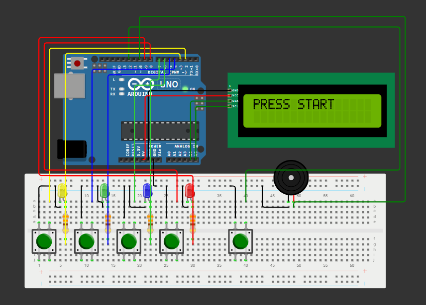

# Arduino Simon Says Game 🎮
A classic memory game implemented using an Arduino Uno, featuring an I2C LCD display, custom difficulty levels, and audio feedback.

**[View Demo on LinkedIn](https://www.linkedin.com/posts/malhar-salunkhe_mini-project-simon-says-game-combined-ugcPost-7343214441007607808-8K5Y?utm_source=share&utm_medium=member_desktop&rcm=ACoAAFJHFE4Brztz-3eARJygA53XmpjYMaQKBHw)**

## 📖 Overview
This project is an electronic implementation of the popular "Simon Says" game. The system generates a sequence of tones and lights that the player must repeat. As the game progresses, the sequences become longer and faster. This version includes a visual interface (LCD) to select difficulty levels and track scores.

## ✨ Features
* **4 Difficulty Levels:** Easy, Medium, Hard, and Insane.
* **Visual Feedback:** 16x2 LCD Display via I2C for game status and instructions.
* **Audio Feedback:** Distinct tones for each LED and game events (Win/Loss/Level Up).
* **State Machine Logic:** Robust code structure handling Idle, Level Selection, and Gameplay states.
* **Debouncing:** Software debouncing implemented for reliable button presses.

## 🛠️ Hardware Requirements
* Arduino Uno (or compatible board)
* 1x 16x2 LCD Display with I2C Interface
* 4x Push Buttons (Game Inputs)
* 1x Push Button (Start/Reset)
* 4x LEDs (Red, Green, Blue, Yellow)
* 4x Resistors (220Ω for LEDs)
* 1x Piezo Buzzer
* Jumper Wires & Breadboard

## 🔌 Circuit & Wiring
Please follow the wiring diagram and pin mapping below to connect all components.



### Pin Mapping Table
| Component | Pin Type | Arduino Pin | Connection Details |
| :--- | :--- | :--- | :--- |
| **I2C LCD** | VCC | 5V | Power |
| **I2C LCD** | GND | GND | Ground |
| **I2C LCD** | SDA | A4 | Data Line (I2C) |
| **I2C LCD** | SCL | A5 | Clock Line (I2C) |
| **Start Button** | Digital | 12 | Button Leg A (Leg B to GND) |
| **Buzzer** | PWM/Digital| 10 | Positive Leg (Negative to GND) |
| **Button 1** | Digital | 2 | Button Leg A (Leg B to GND) |
| **LED 1** | Digital | 3 | Anode (+) via 220Ω Resistor |
| **Button 2** | Digital | 4 | Button Leg A (Leg B to GND) |
| **LED 2** | Digital | 5 | Anode (+) via 220Ω Resistor |
| **Button 3** | Digital | 6 | Button Leg A (Leg B to GND) |
| **LED 3** | Digital | 7 | Anode (+) via 220Ω Resistor |
| **Button 4** | Digital | 8 | Button Leg A (Leg B to GND) |
| **LED 4** | Digital | 9 | Anode (+) via 220Ω Resistor |

**Note on Buttons:** The code uses `INPUT_PULLUP`, so you do **not** need external pull-up resistors. Simply connect one leg of the button to the defined pin and the other leg to GND.

## 💾 How to Use the Code

### Prerequisites
Before uploading the code, ensure you have:
1. **Arduino IDE** installed on your computer ([Download here](https://www.arduino.cc/en/software))
2. **LiquidCrystal_I2C Library** installed in your Arduino IDE

### Installing the Required Library
The code uses the `LiquidCrystal_I2C` library for LCD communication. To install it:

**Method 1: Arduino Library Manager (Recommended)**
1. Open Arduino IDE
2. Go to **Sketch** → **Include Library** → **Manage Libraries...**
3. In the Library Manager search box, type `LiquidCrystal I2C`
4. Find the library by **Frank de Brabander** (or similar)
5. Click **Install**

**Method 2: Manual Installation**
1. Download the library from [GitHub](https://github.com/johnrickman/LiquidCrystal_I2C)
2. Extract the ZIP file
3. Copy the folder to your Arduino libraries directory:
   - **Windows:** `Documents\Arduino\libraries\`
   - **Mac:** `~/Documents/Arduino/libraries/`
   - **Linux:** `~/Arduino/libraries/`
4. Restart Arduino IDE

### Finding Your LCD I2C Address
If your LCD doesn't display anything, you may need to verify the I2C address:
1. The default address in the code is `0x27`
2. Some LCD modules use `0x3F` instead
3. To find your LCD address, use an I2C scanner sketch ([available here](https://playground.arduino.cc/Main/I2cScanner/))
4. If your address differs, change line 11 in the code:
   ```cpp
   LiquidCrystal_I2C lcd(0x27, 16, 2); // Change 0x27 to your address
   ```

### Uploading the Code
1. **Connect your Arduino** to your computer via USB cable
2. **Open the Arduino IDE**
3. **Copy the code** from `simon_says_game.ino` and paste it into a new sketch
4. **Select your board:**
   - Go to **Tools** → **Board** → Select **Arduino Uno** (or your specific board)
5. **Select the port:**
   - Go to **Tools** → **Port** → Select the COM port your Arduino is connected to
   - On Mac/Linux, it typically shows as `/dev/cu.usbmodem...` or `/dev/ttyUSB...`
6. **Verify the code:**
   - Click the **Checkmark (✓)** button to compile and check for errors
7. **Upload:**
   - Click the **Right Arrow (→)** button to upload the code to your Arduino
8. Wait for the "Done uploading" message

### Testing Your Setup
After uploading:
1. The LCD should display **"PRESS START"**
2. If the LCD is blank, adjust the contrast potentiometer on the I2C module
3. If you see garbled text, verify the I2C address as mentioned above
4. Press the Start button to verify the system responds

### Troubleshooting
| Issue | Solution |
| :--- | :--- |
| LCD shows nothing | Check I2C connections (SDA to A4, SCL to A5). Adjust LCD contrast. |
| LCD shows blocks/garbled text | Wrong I2C address. Use I2C scanner or try 0x3F instead of 0x27. |
| Compilation error about library | Install LiquidCrystal_I2C library following steps above. |
| Buttons not responding | Check connections and ensure buttons connect pin to GND. |
| No buzzer sound | Verify buzzer polarity and connection to pin 10. |

### Customizing the Code
You can easily modify game parameters:

**Change LED Pins:**
```cpp
int LED[4] = {3, 5, 7, 9};  // Modify these pin numbers
```

**Change Button Pins:**
```cpp
int Button[4] = {2, 4, 6, 8};  // Modify these pin numbers
```

**Modify Difficulty Sequences:**
```cpp
int easy[5] = {0, 1, 2, 1, 3};  // Add or change sequence steps
```

**Adjust Game Speed:**
```cpp
delay(500);  // Time LED stays on (line 216)
delay(300);  // Delay between sequence steps (line 220)
```

## 🕹️ How to Play
1.  **Power On:** Connect the Arduino to power. The LCD will prompt "PRESS START".
2.  **Start Game:** Press the Start Button (Pin 12).
3.  **Select Level:** Use the 4 game buttons to highlight a difficulty level. Press the same button again to confirm your selection.
4.  **Memorize:** Watch the LED sequence and listen to the tones.
5.  **Repeat:** Press the buttons in the exact order shown.
6.  **Progress:** If correct, the level advances, and the sequence gets longer. If wrong, the Game Over screen appears with your score.

## 💻 Code Structure
The code is built around a Finite State Machine (FSM) with three main states:
1.  `IDLE`: Waiting for the user to start.
2.  `SELECT_LEVEL`: User chooses the difficulty.
3.  `GAME_RUNNING`: The core game loop handling sequences and input validation.

## 📜 License
This project is open-source. Feel free to use and modify it for your own learning!

---
*Created by [Malhar Salunkhe](https://www.linkedin.com/in/malhar-salunkhe/)*
